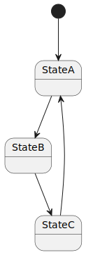

# Usage

To use this plugin in your **`nmk`** project, insert this reference in your **nmk.yml** main file:

```yaml
refs:
  - pip://nmk-doc!plugin.yml
```

## Write documentation

Then you can start writing documentation by adding an **index.md** file in your project **doc** sub-folder. Once done, **`nmk`** build will:

- generate the [sphinx](https://www.sphinx-doc.org/) **conf.py** file in the **doc** sub-folder
- build the documentation; you can check the result by browsing the **out/doc/index.html** file

## Generate **PlantUML** diagrams

This plugin also enables images generation from [PlantUML](https://plantuml.com/) diagrams. If you add some **.puml** diagram files in your project **diagrams** sub-folder, **`nmk`** build will:

- download the **PlantUML** runtime
- generate all images from your **.puml** diagrams; you can check the result by browsing the **doc/diagrams** folder

```{note}
**PlantUML** is a **java** application, so **java** needs to be installed on your system. See [nmk-base **java** handling](https://nmk-base.readthedocs.io/en/stable/config.html#java-runtime) for more information on how **java** is detected.

However if **java** is not detected, the build won't fail (a warning will be displayed instead).
```

Here is an example of an image generated from a **PlantUML** diagram:



Diagram source code:

```{include} ../diagrams/example.puml
:literal:
```

## Generate documentation snippets

To avoid maintain manually command outputs documentation, you can use snippets generation feature.
E.g. it's convenient when your project includes some command line tool, and you want to include some help pages in your documentation.

You just need to define the **{ref}`${docSnippets}<docSnippets>`** config item, and the snippets will be generated from the configured commands.

Example configuration:

```yaml
docSnippets:
  example_snippet.txt: "${venvBin}/cowsay -t Moooo"
```

Generated fragment, included in this document:

```{include} snippets/example_snippet.txt
:literal:
```
